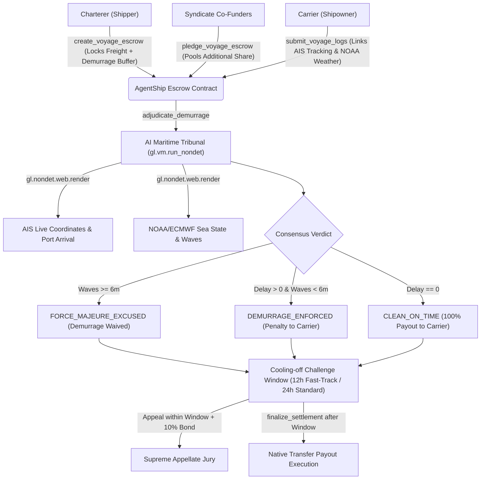

# ⚓ AgentShip: Protocol Architecture & Consensus Mechanics

## Overview
AgentShip is an autonomous maritime demurrage dispute and weather risk court deployed on GenLayer. It bridges international maritime law (BIMCO / Laytime Charterparty rules) with subjective AI validator consensus.

## Consensus Security & Injection Defense
1. **Security Canary Token**: `CANARY_AGENT_SHIP_MARITIME_V1` is enforced in the system prompt and validated in `validator_fn`.
2. **XML Isolation Boundaries**: All external telemetry text from AIS and NOAA stations is wrapped in `<voyage_data>` tags and treated as strictly untrusted inputs.
3. **Dual Cryptographic Digest**: The contract calculates `SHA-256(combined_telemetry)` and requires that leader and validator consensus match the exact snapshot digest.
4. **Milestone v3 Fast-Track Engine**: Grantees and carriers with Gold ($\ge 50$ pts) or Platinum ($\ge 100$ pts) trust status automatically unlock a 12-block dispute window.
